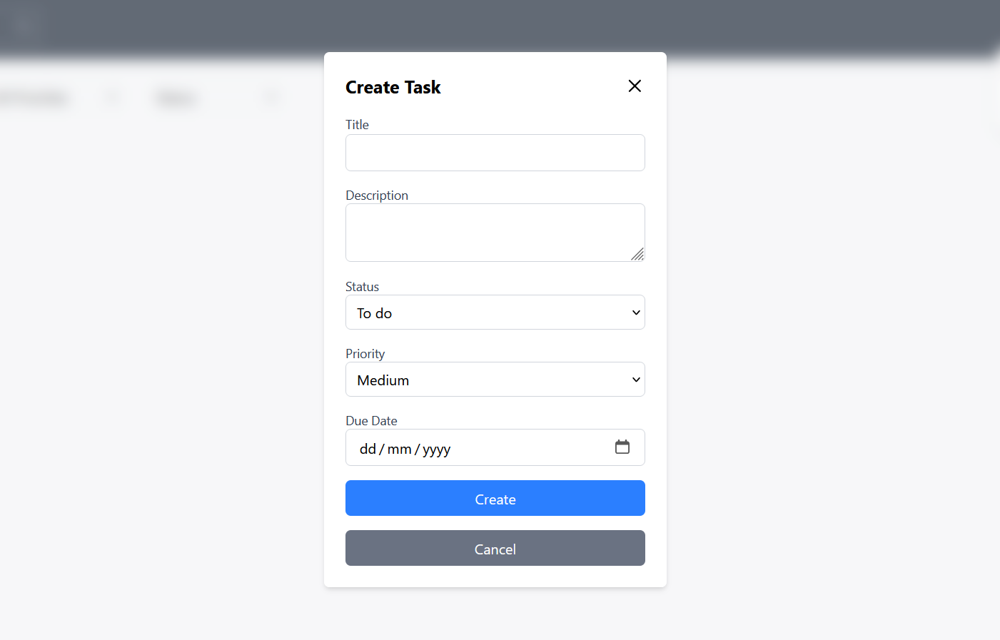

# Task Management App - Scedulify

A full-stack task management application built with **TypeScript** using the **MERN stack**. It provides users with the ability to create, update, delete, and manage tasks efficiently.

## Features

- **User Authentication** – Secure login and signup with JWT authentication.
- **Task Management** – Create, edit, delete, and update tasks.
- **Priority & Status** – Assign priorities (High, Medium, Low) and track status (To do, In Progress, Completed).
- **Due Dates** – Set deadlines for tasks.
- **Mobile Responsive** – Fully responsive UI built with React and Tailwind CSS.

## Tech Stack

### Frontend:

- React with TypeScript
- Vite for fast development
- Tailwind CSS for styling

### Backend:

- Node.js with Express.js
- MongoDB with Mongoose
- TypeScript for type safety
- JWT for authentication

The main dashboard provides an overview of all tasks, categorized by their status (To-do, In Progress, Completed). Users can quickly view, edit, and manage their tasks.

The filter feature allows users to refine task lists based on priority, status, or due date, making it easier to manage tasks efficiently.

A search bar is included to help users quickly find specific tasks by title or description.

The task creation page provides a simple form where users can add new tasks with a title, description, due date, priority, and status.

